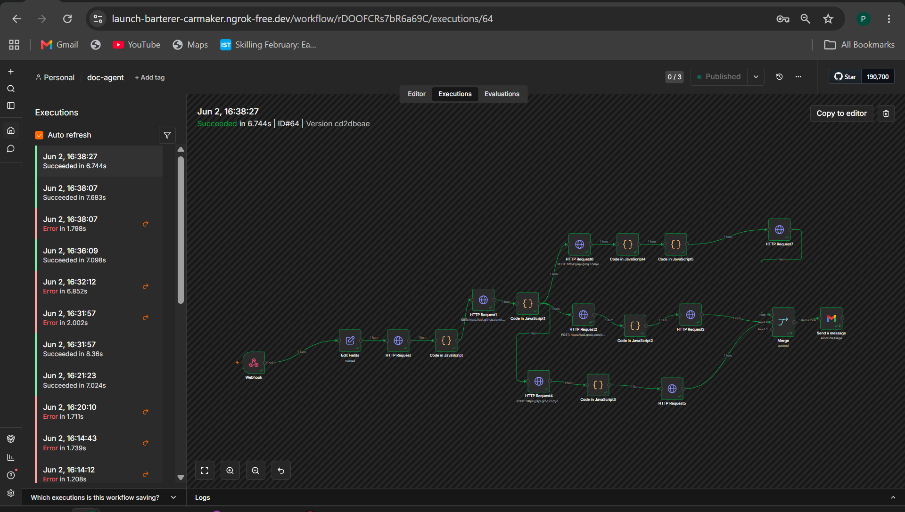
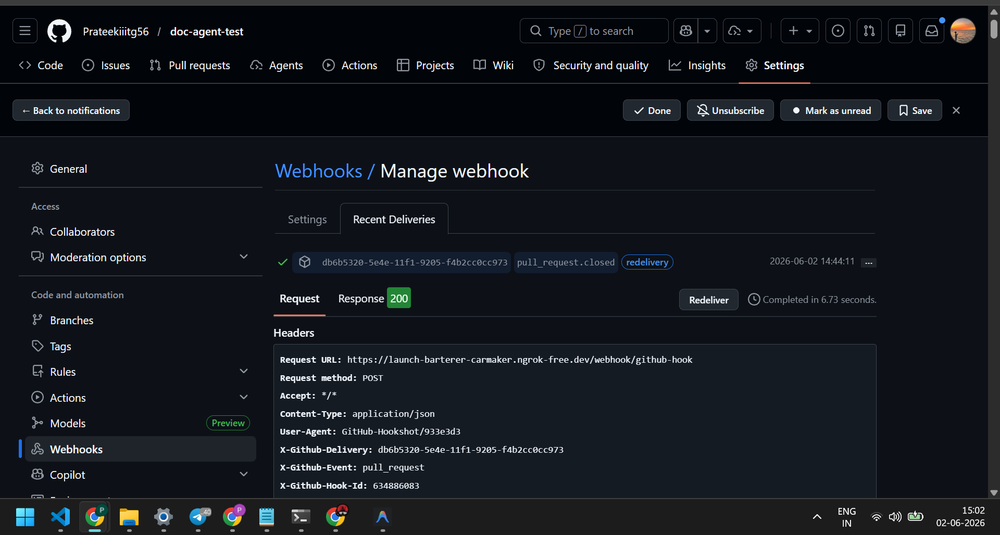
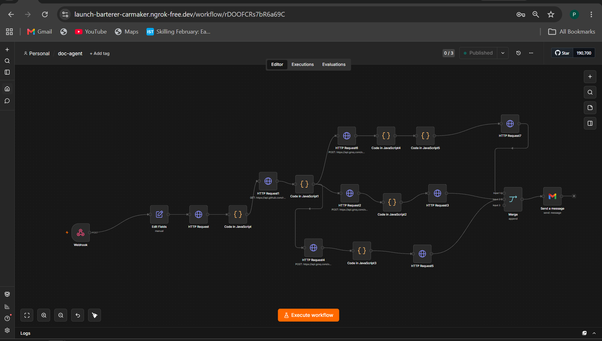

# Automated Documentation and Tutorial Agent

An end-to-end automation pipeline that monitors a GitHub repository for pull request merges and automatically generates updated documentation, technical blog posts, and tutorial video scripts - eliminating the manual overhead of keeping project documentation in sync with code changes.

---

## Table of Contents

- [Problem Statement](#problem-statement)
- [Solution Overview](#solution-overview)
- [Features](#features)
- [Tech Stack](#tech-stack)
- [Architecture](#architecture)
- [Workflow Breakdown](#workflow-breakdown)
- [Setup and Installation](#setup-and-installation)
- [Usage](#usage)
- [Demo](#demo)
- [Generated Outputs](#generated-outputs)
- [Project Structure](#project-structure)
- [Design Decisions](#design-decisions)
- [Limitations and Future Scope](#limitations-and-future-scope)
- [Author](#author)

---

## Problem Statement

In modern software development, documentation consistently lags behind code. Every time a feature is merged, the README becomes stale, onboarding materials grow outdated, and knowledge transfer breaks down. Maintaining documentation manually is tedious, error-prone, and often deprioritized — leading to a growing gap between what the code does and what the docs say.

The task is to build an **Automated Documentation Lifecycle Agent** that:

1. Monitors a GitHub repository for new feature merges.
2. Automatically updates the project README.md with details about the new feature.
3. Generates a technical blog post explaining the feature.
4. Produces a tutorial/how-to video script with AI-generated narration.

---

## Solution Overview

This project implements a **zero-touch documentation pipeline** using n8n as the workflow orchestration engine, GitHub Webhooks for event-driven triggering, and Groq's LLM API for intelligent content generation.

When a pull request is merged into the main branch:

1. A GitHub Webhook fires a payload to the n8n workflow.
2. The workflow extracts the PR metadata (title, description, diff/changed files).
3. The code diff is fetched via the GitHub API.
4. Groq's LLM analyzes the diff and generates three distinct outputs:
   - An updated README section documenting the new feature.
   - A structured technical blog post explaining the change.
   - A tutorial video script with narration cues.
5. The updated README is committed back to the repository via the GitHub API.
6. The blog post and video script are stored as generated artifacts.

The entire pipeline executes automatically with no human intervention required after the initial setup.

---

## Features

- **Event-Driven Automation** — Triggered automatically on PR merge via GitHub Webhooks. No polling, no cron jobs.
- **Intelligent README Updates** — Appends well-structured documentation sections to the existing README without overwriting prior content.
- **Technical Blog Generation** — Produces publication-ready blog posts that explain the what, why, and how of each merged feature.
- **Tutorial Video Script Generation** — Creates timestamped, narration-ready scripts suitable for screen recording walkthroughs.
- **Context-Aware Content** — All generated content is grounded in the actual code diff, not hallucinated from the PR title alone.
- **Idempotent Execution** — Safe to re-trigger; does not create duplicate entries or corrupt existing documentation.
- **Visual Workflow Orchestration** — The entire pipeline is defined as an importable n8n workflow, making it transparent and modifiable.

---

## Tech Stack

| Component              | Technology        | Purpose                                           |
|------------------------|-------------------|---------------------------------------------------|
| Workflow Orchestration | n8n               | Visual automation engine; connects all pipeline stages |
| Event Trigger          | GitHub Webhooks   | Delivers real-time PR merge events to the pipeline     |
| Repository Integration | GitHub REST API   | Fetches PR diffs, reads/writes files to the repo       |
| Content Generation     | Groq API (LLaMA)  | LLM inference for generating documentation content     |
| Version Control        | Git / GitHub      | Source repository hosting and webhook configuration    |
| Content Format         | Markdown          | Output format for README, blog posts, and scripts      |

---

## Architecture

```
GitHub Repository
       |
       | [PR Merged → Webhook fires]
       v
+-------------------------------+
|        GitHub Webhook          |
|  POST payload to n8n endpoint  |
+-------------------------------+
       |
       v
+-------------------------------+
|         n8n Workflow           |
|                               |
|  1. Webhook Trigger Node      |
|     - Receives PR merge event |
|     - Extracts PR metadata    |
|                               |
|  2. GitHub API Node           |
|     - Fetches full code diff  |
|     - Fetches changed files   |
|                               |
|  3. Groq LLM Node (README)   |
|     - Analyzes diff           |
|     - Generates README section|
|                               |
|  4. Groq LLM Node (Blog)     |
|     - Generates blog post     |
|                               |
|  5. Groq LLM Node (Script)   |
|     - Generates video script  |
|                               |
|  6. GitHub API Node (Commit)  |
|     - Updates README.md       |
|     - Commits changes to repo |
+-------------------------------+
       |
       v
+-------------------------------+
|       Generated Outputs        |
|  - Updated README.md (in repo)|
|  - Technical blog post         |
|  - Tutorial video script       |
+-------------------------------+
```

**Data Flow Summary:**

1. A developer merges a PR on GitHub.
2. GitHub sends a webhook payload containing PR metadata to the n8n instance.
3. n8n extracts the PR number and fetches the full diff from the GitHub API.
4. The diff is passed to Groq's LLM with tailored prompts for each output type.
5. The generated README update is committed back to the repository.
6. Blog and video script outputs are captured as workflow artifacts.

### n8n Workflow (Visual)



### GitHub Webhook Delivery



### Automated Output



---

## Workflow Breakdown

### Node 1: Webhook Trigger

- Listens for `pull_request` events with `action: closed` and `merged: true`.
- Extracts: PR title, description, author, branch name, and PR number.

### Node 2: Fetch PR Diff

- Calls `GET /repos/{owner}/{repo}/pulls/{pr_number}/files` via the GitHub API.
- Retrieves the list of changed files and their patch content.
- Aggregates the diff into a single context string for the LLM.

### Node 3: Generate README Update

- Sends the diff context to Groq with a system prompt instructing it to generate a concise, well-structured README section.
- The prompt specifies Markdown formatting, feature description, and usage examples.

### Node 4: Generate Blog Post

- Uses a separate prompt tailored for long-form technical writing.
- Instructs the LLM to explain the motivation, implementation details, and impact of the change.
- Output follows a structured blog format with introduction, body, and conclusion.

### Node 5: Generate Video Script

- Prompt designed for narration-style output with timestamps and visual cues.
- Generates a script suitable for a 1-minute how-to walkthrough.
- Includes sections: intro, demonstration steps, and closing.

### Node 6: Commit README Update

- Fetches the current README.md content and its SHA from the repository.
- Appends the generated section to the existing content.
- Commits the updated file via `PUT /repos/{owner}/{repo}/contents/README.md`.

---

## Setup and Installation

### Prerequisites

- [n8n](https://n8n.io/) — installed locally or accessible via cloud instance.
- A GitHub account with a repository to monitor.
- A [Groq API key](https://console.groq.com/keys) for LLM inference.
- A GitHub Personal Access Token with the following permissions:
  - `Contents`: Read and Write
  - `Pull Requests`: Read and Write
  - `Metadata`: Read-only

### Step 1: Clone This Repository

```bash
git clone https://github.com/Prateekiiitg56/automated-documentation-agent.git
cd automated-documentation-agent
```

### Step 2: Import the Workflow into n8n

1. Open your n8n instance.
2. Navigate to **Workflows** and click **Import from File**.
3. Select the `doc-agent.json` file from this repository.
4. The complete workflow will be loaded with all nodes pre-configured.

### Step 3: Configure Environment Variables

1. Copy the environment template:

```bash
cp .env.example .env
```

2. Fill in your credentials:

```
GITHUB_TOKEN=ghp_your_actual_token_here
GROQ_API_KEY=gsk_your_actual_key_here
GITHUB_REPO=your-username/your-repo-name
```

3. In n8n, update the credential nodes with your GitHub token and Groq API key.

### Step 4: Configure GitHub Webhook

1. Go to your target repository on GitHub.
2. Navigate to **Settings > Webhooks > Add webhook**.
3. Set the Payload URL to your n8n webhook endpoint (displayed in the Webhook Trigger node).
4. Set Content type to `application/json`.
5. Select **Let me select individual events** and check **Pull requests**.
6. Save the webhook.

### Step 5: Activate the Workflow

1. In n8n, open the imported workflow.
2. Click **Activate** to start listening for webhook events.
3. The workflow is now live and will trigger on every PR merge.

---

## Usage

Once the setup is complete, the workflow operates autonomously:

1. Create a feature branch in your monitored repository.
2. Make code changes and commit them.
3. Open a Pull Request to the main branch.
4. Merge the Pull Request.
5. The webhook fires and triggers the n8n workflow.
6. Within seconds, the following are generated:
   - The repository README.md is updated with a new section describing the feature.
   - A technical blog post is generated.
   - A tutorial video script is generated.

No manual intervention is required after the initial setup.

---

## Demo

A full demonstration video showing the end-to-end pipeline in action:

**[Watch the Demo Video](https://drive.google.com/file/d/13vSu9dFpiqVgzkXrHUZWl-eTx711PHSY/view?pli=1)**

The video shows:
1. A pull request being created and merged on GitHub.
2. The webhook firing and triggering the n8n workflow.
3. The workflow executing all nodes successfully.
4. The repository README being updated automatically.
5. The generated blog post and video script outputs.

---

## Generated Outputs

The `generated-output/` directory contains example outputs produced by the pipeline during testing:

| File                  | Description                                                  |
|-----------------------|--------------------------------------------------------------|
| `generated-blog.md`  | A technical blog post generated from a test PR merge         |
| `updated-readme.md`  | The README section that was auto-appended to the repository  |
| `video-script.md`    | A narration-ready tutorial script for a how-to video         |

These files demonstrate the quality and structure of the AI-generated content.

---

## Project Structure

```
automated-documentation-agent/
|
|-- README.md                          # Project documentation (this file)
|-- doc-agent.json                     # Exportable n8n workflow definition
|-- .env.example                       # Environment variables template
|-- .gitignore                         # Git ignore rules
|
|-- docs/
|   |-- approach.md                    # Technical approach and design rationale
|
|-- generated-output/
|   |-- generated-blog.md             # Example: AI-generated blog post
|   |-- updated-readme.md             # Example: Auto-generated README section
|   |-- video-script.md               # Example: AI-generated tutorial script
|
|-- screenshots/
    |-- workflow.png                   # n8n workflow execution screenshot
    |-- webhook.png                    # GitHub webhook delivery screenshot
    |-- automate.png                   # Automated output screenshot
```

---

## Design Decisions

### Why n8n?

n8n was chosen as the orchestration engine for several reasons:

- **Visual workflow design** makes the entire pipeline transparent and auditable. Every step is visible as a node, making it easy to debug, extend, or modify.
- **Native HTTP and webhook support** eliminates the need for custom server code to receive GitHub events.
- **Built-in credential management** provides secure storage for API keys and tokens.
- **Self-hosted option** ensures that sensitive repository data and API keys never leave the local environment.
- **Rapid prototyping** — the complete pipeline was built and tested without writing a custom backend.

### Why Groq?

Groq was selected as the LLM inference provider because:

- **Low-latency inference** — Groq's hardware-accelerated inference delivers responses in under 2 seconds, which is critical for keeping the automation pipeline responsive.
- **High-quality Markdown generation** — The LLaMA models available through Groq produce well-structured, coherent Markdown output suitable for documentation.
- **Generous free tier** — Sufficient for development, testing, and demonstration without incurring costs.
- **Simple REST API** — Clean integration with n8n's HTTP request nodes.

### Why Webhooks over Polling?

- Webhooks provide **real-time, event-driven** triggers with zero latency after a merge.
- Polling introduces unnecessary delay and API rate limit consumption.
- Webhooks are the standard pattern for GitHub automation workflows.

---

## Limitations and Future Scope

### Current Limitations

- The pipeline requires an active n8n instance to receive webhooks. If n8n is offline, events are missed (GitHub retries webhooks for a limited time).
- Video script generation produces text-based scripts; actual video rendering with AI voiceover is not yet automated in this version.
- The system processes one PR at a time. Concurrent merges may result in race conditions on README updates.

### Future Improvements

- **Automated video rendering** — Integrate with tools like FFmpeg and a TTS API (e.g., ElevenLabs) to render the generated script into an actual video with AI voiceover.
- **Conflict resolution** — Add locking or queuing to handle concurrent PR merges gracefully.
- **Multi-repository support** — Extend the webhook to monitor multiple repositories from a single workflow.
- **Customizable templates** — Allow users to define their own prompt templates for different documentation styles.
- **Slack/Discord notifications** — Send alerts when documentation is auto-updated.

---

## Author

**Prateek Singh**
- GitHub: [Prateekiiitg56](https://github.com/Prateekiiitg56)

---

*Built as part of the Eskillveda Summer Internship Program 2026 — Technical Assessment.*
